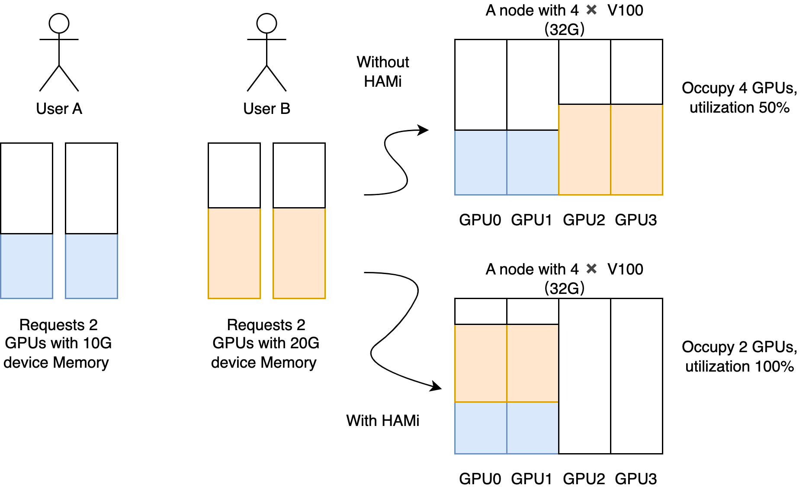
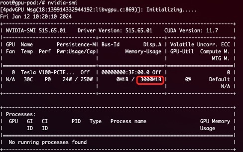

# Volcano vgpu device plugin for Kubernetes

[](https://app.fossa.com/projects/git%2Bgithub.com%2FProject-HAMi%2Fvolcano-vgpu-device-plugin?ref=badge_shield)
[](https://hub.docker.com/r/projecthami/volcano-vgpu-device-plugin)

**Note**:

Volcano vgpu device-plugin can provide device-sharing mechanism for NVIDIA devices managed by volcano.

This is based on [Nvidia Device Plugin](https://github.com/NVIDIA/k8s-device-plugin), it uses [HAMi-core](https://github.com/Project-HAMi/HAMi-core) to support hard isolation of GPU card.

And collaborate with volcano, it is possible to enable GPU sharing.

## Table of Contents

- [About](#about)
- [Prerequisites](#prerequisites)
- [Quick Start](#quick-start)
  - [Preparing your GPU Nodes](#preparing-your-gpu-nodes)
  - [Enabling vGPU Support in Kubernetes](#enabling-gpu-support-in-kubernetes)
  - [Testing without real GPUs (nvml-mock)](#testing-without-real-gpus-nvml-mock)
  - [Running vGPU Jobs](#running-vgpu-jobs)
- [Issues and Contributing](#issues-and-contributing)

## Version Compatibility Matrix

The following table shows the compatibility matrix between Volcano-vgpu and Volcano versions. Please ensure you are using compatible versions.

| Volcano-vgpu | Volcano |
|--------------|---------|
| v1.12.0 and below | v1.15.0 and below |
| master       | master  |

## About

The Volcano device plugin for Kubernetes is a Daemonset that allows you to automatically:
- Expose the number of GPUs on each node of your cluster
- Keep track of the health of your GPUs
- Run GPU enabled containers in your Kubernetes cluster.
- Provide device-sharing mechanism for GPU tasks as the figure below.
- Enforce hard resource limit in container.
- Support dynamic-mig, for more details, see [config](doc/config.md)  

 

## Prerequisites

The list of prerequisites for running the Volcano device plugin is described below:
* NVIDIA drivers > 440
* nvidia-docker version > 2.0 (see how to [install](https://github.com/NVIDIA/nvidia-docker) and it's [prerequisites](https://github.com/nvidia/nvidia-docker/wiki/Installation-\(version-2.0\)#prerequisites))
* docker configured with nvidia as the [default runtime](https://github.com/NVIDIA/nvidia-docker/wiki/Advanced-topics#default-runtime).
* Kubernetes version >= 1.16
* Volcano verison >= 1.9

## Quick Start

### Preparing your GPU Nodes

The following steps need to be executed on all your GPU nodes.
This README assumes that the NVIDIA drivers and nvidia-docker have been installed.

Note that you need to install the nvidia-docker2 package and not the nvidia-container-toolkit.
This is because the new `--gpus` options hasn't reached kubernetes yet. Example:
```bash
# Add the package repositories
$ distribution=$(. /etc/os-release;echo $ID$VERSION_ID)
$ curl -fsSL https://nvidia.github.io/nvidia-docker/gpgkey | sudo gpg --dearmor -o /usr/share/keyrings/nvidia-docker-keyring.gpg
$ curl -s -L https://nvidia.github.io/nvidia-docker/$distribution/nvidia-docker.list | \
    sed 's#deb https://#deb [signed-by=/usr/share/keyrings/nvidia-docker-keyring.gpg] https://#g' | \
    sudo tee /etc/apt/sources.list.d/nvidia-docker.list

$ sudo apt-get update && sudo apt-get install -y nvidia-docker2
$ sudo systemctl restart docker
```

You will need to enable the nvidia runtime as your default runtime on your node.
We will be editing the docker daemon config file which is usually present at `/etc/docker/daemon.json`:
```json
{
    "default-runtime": "nvidia",
    "runtimes": {
        "nvidia": {
            "path": "/usr/bin/nvidia-container-runtime",
            "runtimeArgs": []
        }
    }
}
```
> *if `runtimes` is not already present, head to the install page of [nvidia-docker](https://github.com/NVIDIA/nvidia-docker)*


### Configuration

You need to enable vgpu in volcano-scheduler configMap:

```shell script
kubectl edit cm -n volcano-system volcano-scheduler-configmap
```

For volcano v1.9+,, use the following configMap 
```yaml
kind: ConfigMap
apiVersion: v1
metadata:
  name: volcano-scheduler-configmap
  namespace: volcano-system
data:
  volcano-scheduler.conf: |
    actions: "enqueue, allocate, backfill"
    tiers:
    - plugins:
      - name: priority
      - name: gang
      - name: conformance
    - plugins:
      - name: drf
      - name: deviceshare
        arguments:
          deviceshare.VGPUEnable: true # enable vgpu
          deviceshare.SchedulePolicy: binpack  # scheduling policy. binpack / spread
      - name: predicates
      - name: proportion
      - name: nodeorder
      - name: binpack
```

### Sharing Mode

Volcano-vgpu supports two types of device-sharing: `HAMi-core` and `dynamia-mig`, A node can either using `HAMi-core`, or `Dynamic-mig`. Heterogeneous is supported(a part of node using HAMi-core, the other using Dynamic-mig)

A brief introduction about these two modes:

HAMi-core is a user-layer resource isolator provided by HAMi community, works on all types of GPU.

Dynamic-mig is a hardware resource isolator, works on Ampere arch or later GPU. 

The table below shows the summary:
| Mode        | Isolation        | MIG GPU Required | Annotation | Core/Memory Control | Recommended For            |
| ----------- | ---------------- | ---------------- | ---------- | ------------------- | -------------------------- |
| HAMI-core   | Software (VCUDA) | No               | No         | Yes                 | General workloads          |
| Dynamic MIG | Hardware         | Yes              | Yes        | MIG-controlled      | Performance-sensitive jobs |

You can set the sharing mode and customize your installation by adjusting the [configs](doc/config.md)


### Enabling GPU Support in Kubernetes

Once you have enabled this option on *all* the GPU nodes you wish to use,
you can then enable GPU support in your cluster by deploying the following Daemonset:

#### Configure and install with Helm

Add the volcano-vgpu-device-plugin Helm repository:

```
helm repo add volcano-vgpu-device-plugin https://project-hami.github.io/volcano-vgpu-device-plugin
helm repo update
```

Install the chart:
```
helm install volcano-vgpu-device-plugin volcano-vgpu-device-plugin/volcano-vgpu-device-plugin
```

If you want to enable CDI, you can use the following command to install.
```
helm install volcano-vgpu-device-plugin volcano-vgpu-device-plugin/volcano-vgpu-device-plugin \
    --set cdi.enabled=true
```

#### Install with yaml

##### Normal Mode

```
$ kubectl apply -f deployments/static/volcano-vgpu-device-plugin.yml
```
##### CDI Mode
###### Modify deployments/static/volcano-vgpu-device-plugin.yml
1. Add the following environment variables to the `env` section of the `volcano-device-plugin` container.
```
- name: DEVICE_LIST_STRATEGY
  value: "cdi-annotations"
- name: NVIDIA_DRIVER_ROOT
  value: /
- name: NVIDIA_CDI_HOOK_PATH
  value: /usr/bin/nvidia-ctk
- name: GDRCOPY_ENABLED
  value: "false"
- name: GDS_ENABLED
  value: "false"
- name: MOFED_ENABLED
  value: "false"
```
2. Add the following configuration to the `volumeMounts` section of the `volcano-device-plugin` container.
```
- name: cdi-root
  mountPath: /var/run/cdi
- name: driver-root
  mountPath: /driver-root
  readOnly: true
- name: usrbin
  mountPath: /usrbin
  readOnly: true
```
3. Add the following configuration to the `volumes` section.
```
- name: driver-root
  hostPath:
    path: /
    type: Directory
- name: cdi-root
  hostPath:
    path: /var/run/cdi
    type: DirectoryOrCreate
- name: usrbin
  hostPath:
    path: /usr/bin
    type: Directory
```
###### Deploy
```
$ kubectl apply -f deployments/static/volcano-vgpu-device-plugin.yml
```

### Testing without real GPUs (nvml-mock)

For local development or CI without physical GPUs, the device-plugin can run
against [nvml-mock](https://github.com/nvidia/k8s-test-infra), which provides a
fake `libnvidia-ml.so` that simulates GPU devices on a kind cluster. The same
approach is used by the [HAMi nvml-mock lab](https://project-hami.io/tutorials/labs/nvml-mock).

> **Note:** nvml-mock only simulates the device discovery path. Use it to verify
> scheduling and registration behavior — the monitor container is automatically
> disabled because it cannot resolve the mock NVML library (`SetNvmlLibraryPath`
> is only called by the device-plugin binary, and the monitor container does
> not mount the mock driver root), so it would fail NVML initialization.
>
> **Note:** `nvmlMock.enabled` and `cdi.enabled` are mutually exclusive. The
> nvml-mock driver root would override the CDI driver root, so the Helm chart
> fails at render time if both are set to `true`.

#### 1. Deploy nvml-mock

Deploy nvml-mock first so the fake driver and `libnvidia-ml.so` are installed on
the node (default host path: `/var/lib/nvml-mock/driver`):

```bash
helm install nvml-mock oci://ghcr.io/nvidia/k8s-test-infra/chart/nvml-mock
```

#### 2. Deploy the device-plugin with nvml-mock (Helm)

nvml-mock support is provided through the Helm chart only, so that
`KLOG_LEVEL`, `DEVICE_CONFIG_NAMESPACE`, and other plugin settings stay in sync
with the rest of the deployment:

```bash
helm install volcano-vgpu-device-plugin volcano-vgpu-device-plugin/volcano-vgpu-device-plugin \
    --set nvmlMock.enabled=true
```

Adjust the driver root if your nvml-mock install uses a non-default path:

```bash
helm install volcano-vgpu-device-plugin volcano-vgpu-device-plugin/volcano-vgpu-device-plugin \
    --set nvmlMock.enabled=true \
    --set nvmlMock.driverRoot=/var/lib/nvml-mock/driver
```

When `nvmlMock.enabled=true`, the chart injects the `NVIDIA_DRIVER_ROOT`,
`CONTAINER_DRIVER_ROOT`, `NVIDIA_DEV_ROOT`, `DEVICE_DISCOVERY_STRATEGY=nvml`,
and `DP_DISABLE_HEALTHCHECKS=all` environment variables, mounts the mock driver
root, and disables the monitor container.

#### 3. Verify

Once the device-plugin pod is running, check the node capacity — a fake
`volcano.sh/vgpu-number` resource should appear, same as with real GPUs:

```shell script
$ kubectl get node {node name} -oyaml
...
  capacity:
    volcano.sh/vgpu-number: "40"   # simulated vGPU resource
```

The exact number equals (fake GPUs from the nvml-mock profile) ×
`deviceConfig.nvidia.deviceSplitCount`. The nvml-mock chart's default `gb300`
profile exposes 4 fake GPUs, so with the default `deviceSplitCount: 10` the
node reports `40`; a profile with 8 GPUs (e.g. `a100`) reports `80`.

### Verify environment is ready

Check the node status, it is ok if `volcano.sh/vgpu-number` is included in the allocatable resources.

```shell script
$ kubectl get node {node name} -oyaml
...
  capacity:
    volcano.sh/vgpu-memory: "89424"
    volcano.sh/vgpu-number: "10"   # vGPU resource
```

### Running VGPU Jobs

VGPU can be requested by both set "volcano.sh/vgpu-number" , "volcano.sh/vgpu-cores" and "volcano.sh/vgpu-memory" in resource.limit

```shell script
$ cat <<EOF | kubectl apply -f -
apiVersion: v1
kind: Pod
metadata:
  name: gpu-pod1
  annotations:
    volcano.sh/vgpu-mode: "hami-core" # (Optional, 'hami-core' or 'mig')
spec:
  schedulerName: volcano
  containers:
    - name: cuda-container
      image: nvidia/cuda:9.0-devel
      command: ["sleep"]
      args: ["100000"]
      resources:
        limits:
          volcano.sh/vgpu-number: 2 # requesting 2 gpu cards
          volcano.sh/vgpu-memory: 3000 # (optinal)each vGPU uses 3G device memory
          volcano.sh/vgpu-cores: 50 # (optional)each vGPU uses 50% core  
EOF
```

You can validate device memory using nvidia-smi inside container:



> **WARNING:** *if you don't request GPUs when using the device plugin with NVIDIA images all
> the GPUs on the machine will be exposed inside your container.
> The number of vgpu used by a container can not exceed the number of gpus on that node.*
> You can specify the mode of this task by assigning `volcano.sh/vgpu-mode` annotations, If not, both modes are possible.

### Monitor

volcano-scheduler-metrics records every GPU usage and limitation, visit the following address to get these metrics.

```
curl {volcano scheduler cluster ip}:8080/metrics
```

You can also collect the **GPU utilization**, **GPU memory usage**, **pods' GPU memory limitations** and **pods' GPU memory usage** metrics on nodes by visiting the following addresses:

```
curl {volcano device plugin pod ip}:9394/metrics
```

Example:
```
# HELP Device_last_kernel_of_container Container device last kernel description
# TYPE Device_last_kernel_of_container gauge
Device_last_kernel_of_container{ctrname="cuda-container",deviceuuid="GPU-xxxx",podname="hami-device",podnamespace="default",vdeviceid="0",zone="vGPU"} 0
# HELP Device_memory_desc_of_container Container device meory description
# TYPE Device_memory_desc_of_container counter
Device_memory_desc_of_container{context="331350016",ctrname="cuda-container",data="1778516992",deviceuuid="GPU-xxxx",module="0",offset="0",podname="hami-device",podnamespace="default",vdeviceid="0",zone="vGPU"} 2.109867008e+09
# HELP Device_utilization_desc_of_container Container device utilization description
# TYPE Device_utilization_desc_of_container gauge
Device_utilization_desc_of_container{ctrname="cuda-container",deviceuuid="GPU-xxxx",podname="hami-device",podnamespace="default",vdeviceid="0",zone="vGPU"} 99
# HELP HostCoreUtilization GPU core utilization
# TYPE HostCoreUtilization gauge
HostCoreUtilization{deviceidx="0",deviceuuid="GPU-xxxx",zone="vGPU"} 0
HostCoreUtilization{deviceidx="1",deviceuuid="GPU-xxxx",zone="vGPU"} 100
# HELP HostGPUMemoryUsage GPU device memory usage
# TYPE HostGPUMemoryUsage gauge
HostGPUMemoryUsage{deviceidx="0",deviceuuid="GPU-xxxx",zone="vGPU"} 5.6366661632e+10
HostGPUMemoryUsage{deviceidx="1",deviceuuid="GPU-xxxx",zone="vGPU"} 5.8484457472e+10
# HELP vGPU_device_memory_limit_in_bytes vGPU device limit
# TYPE vGPU_device_memory_limit_in_bytes gauge
vGPU_device_memory_limit_in_bytes{ctrname="cuda-container",deviceuuid="GPU-xxxx",podname="hami-device",podnamespace="default",vdeviceid="0",zone="vGPU"} 3.145728e+09
# HELP vGPU_device_memory_usage_in_bytes vGPU device usage
# TYPE vGPU_device_memory_usage_in_bytes gauge
vGPU_device_memory_usage_in_bytes{ctrname="cuda-container",deviceuuid="GPU-xxxx",podname="hami-device",podnamespace="default",vdeviceid="0",zone="vGPU"} 2.109867008e+09
```

# Issues and Contributing
[Checkout the Contributing document!](CONTRIBUTING.md)

* You can report a bug by [filing a new issue](https://github.com/Project-HAMi/volcano-vgpu-device-plugin)
* You can contribute by opening a [pull request](https://help.github.com/articles/using-pull-requests/)


## Upgrading Kubernetes with the device plugin

Upgrading Kubernetes when you have a device plugin deployed doesn't require you to do any,
particular changes to your workflow.
The API is versioned and is pretty stable (though it is not guaranteed to be non breaking),
upgrading kubernetes won't require you to deploy a different version of the device plugin and you will
see GPUs re-registering themselves after you node comes back online.


Upgrading the device plugin is a more complex task. It is recommended to drain GPU tasks as
we cannot guarantee that GPU tasks will survive a rolling upgrade.
However we make best efforts to preserve GPU tasks during an upgrade.


## License
[](https://app.fossa.com/projects/git%2Bgithub.com%2FProject-HAMi%2Fvolcano-vgpu-device-plugin?ref=badge_large)
